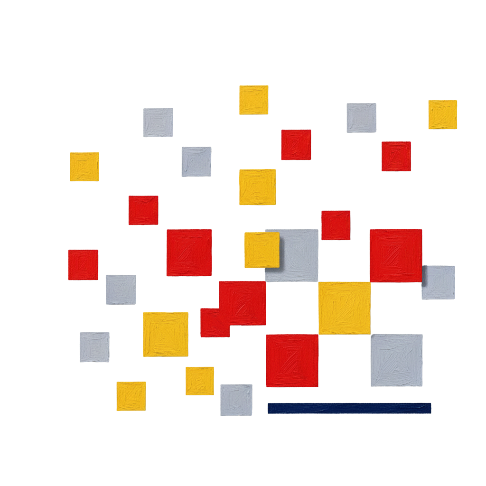

# Building the Wise MMDC Website from Scratch
## A Complete Step-by-Step Guide

---

## Table of Contents
1. [Project Overview](#project-overview)
2. [Planning Phase](#planning-phase)
3. [Setting Up Your Development Environment](#setting-up-your-development-environment)
4. [Project Structure](#project-structure)
5. [Building the Foundation - HTML Structure](#building-the-foundation---html-structure)
6. [Styling with CSS](#styling-with-css)
7. [Integrating Bootstrap Framework](#integrating-bootstrap-framework)
8. [Adding JavaScript Interactivity](#adding-javascript-interactivity)
9. [Making it Responsive](#making-it-responsive)
10. [Testing and Debugging](#testing-and-debugging)
11. [Deployment](#deployment)
12. [Best Practices and Tips](#best-practices-and-tips)

---

## Project Overview

### What We're Building
The **Wise MMDC** website is a student expense comparison tool designed to help Filipino students compare monthly costs between traditional on-campus learning and online learning at MMDC. The website consists of:

- **Homepage**: Landing page with hero section and blog cards
- **Calculator Page**: Interactive expense comparison tool
- **About Page**: Project information and team details

### Technologies Used
- **HTML5**: For semantic structure
- **CSS3**: For custom styling
- **Bootstrap 5.3.2**: For responsive layouts and components
- **JavaScript**: For interactivity and calculations

### Key Features
- Responsive design (mobile, tablet, desktop)
- Interactive calculator with real-time calculations
- Dynamic form fields (add/remove expenses)
- Study mode selection (Traditional vs Online)
- No backend - all client-side processing

---

## Planning Phase

### Step 1: Define Your Purpose
Before writing any code, clearly define:
- **Target Audience**: Filipino students comparing education costs
- **Main Goal**: Help students make informed financial decisions
- **Key Features**: Expense calculator, comparison summary, blog content

### Step 2: Create a Wireframe
Sketch out your pages (on paper or digitally):
```
Homepage Layout:
┌─────────────────────────────────┐
│        HEADER (Logo + Nav)      │
├─────────────────────────────────┤
│    HERO SECTION (CTA Buttons)   │
├─────────────────────────────────┤
│  BLOG CARDS (3 article cards)   │
├─────────────────────────────────┤
│           FOOTER                │
└─────────────────────────────────┘

Calculator Layout:
┌─────────────────────────────────┐
│        HEADER (Logo + Nav)      │
├─────────────────────────────────┤
│    Study Mode Selection         │
├─────────────────────────────────┤
│    Income Input Section         │
├─────────────────────────────────┤
│  Traditional  │  Online         │
│  Expenses     │  Expenses       │
├─────────────────────────────────┤
│    Comparison Summary           │
├─────────────────────────────────┤
│           FOOTER                │
└─────────────────────────────────┘
```

### Step 3: Choose Your Color Scheme
For Wise MMDC, we used colors from the MMDC logo:
- **Primary Navy**: `#1B4F91` (main brand color)
- **Primary Red**: `#E31E24` (accent for warnings/negatives)
- **Primary Gold**: `#F9B233` (accent for highlights)
- **Secondary Gray**: `#A8A8A8` (text and borders)
- **Light Gray**: `#C4C4C4` (subtle borders)
- **Background**: `#f8f9fa` (light gray background)

---

## Setting Up Your Development Environment

### Step 1: Create Project Folder
```
Create a main folder:
C:\Users\YourName\Documents\WiseMMDC\
```

### Step 2: Install a Code Editor
**Recommended**: Visual Studio Code (VS Code)
- Download from https://code.visualstudio.com/
- Install useful extensions:
  - Live Server (for live preview)
  - HTML CSS Support
  - IntelliSense for CSS class names
  - Prettier (code formatter)

### Step 3: Set Up Browser Developer Tools
- Use Chrome or Firefox for development
- Press `F12` to open Developer Tools
- Learn to use:
  - **Elements tab**: Inspect HTML/CSS
  - **Console tab**: View JavaScript errors
  - **Network tab**: Check resource loading
  - **Device toolbar**: Test responsive design

---

## Project Structure

### Step 1: Create Folder Structure
```
WiseMMDC/
│
├── index.html              # Homepage (root level)
├── calculator.html         # Calculator page (root level)
├── about.html             # About page (root level)
│
├── html/                  # Alternative folder structure
│   ├── index.html
│   ├── calculator.html
│   └── about.html
│
├── css/
│   └── style.css          # Main stylesheet
│
├── images/
│   ├── Wise MMDC Logo.png
│   ├── indeximage02.png
│   ├── 1.png              # Blog card 1
│   ├── 2.png              # Blog card 2
│   └── 3.png              # Blog card 3
│
├── script.js              # JavaScript file
│
└── README.md              # Project documentation
```

**Why This Structure?**
- **Root HTML files**: Easy access for web servers
- **css/ folder**: Keeps stylesheets organized
- **images/ folder**: All images in one place
- **Separation of concerns**: HTML, CSS, JS in separate files

### Step 2: Create Empty Files
Right-click in VS Code > New File:
1. `index.html`
2. `calculator.html`
3. `about.html`
4. Create folders: `css`, `images`
5. Inside `css`, create `style.css`
6. Create `script.js` in root

---

## Building the Foundation - HTML Structure

### Understanding HTML5 Semantic Elements
HTML5 provides semantic tags that give meaning to your content:
- `<header>`: Top section with logo and navigation
- `<nav>`: Navigation menu
- `<main>`: Main content area
- `<section>`: Thematic grouping of content
- `<article>`: Self-contained content
- `<footer>`: Bottom section with copyright

### Step 1: Create Basic HTML Template
Every HTML page starts with this structure:

```html
<!DOCTYPE html>
<html lang="en">
<head>
  <meta charset="UTF-8">
  <meta name="viewport" content="width=device-width, initial-scale=1.0">
  <title>Page Title</title>
  <!-- CSS Links go here -->
</head>
<body>
  <!-- Content goes here -->
  <!-- JavaScript Links go here -->
</body>
</html>
```

**Breaking it down:**
- `<!DOCTYPE html>`: Tells browser this is HTML5
- `<html lang="en">`: Root element, language is English
- `<meta charset="UTF-8">`: Character encoding for special characters
- `<meta name="viewport">`: Makes site responsive on mobile
- `<title>`: Shows in browser tab

### Step 2: Build the Homepage (index.html)

#### A. Create the Header Section
```html
<header class="header">
  <nav class="navbar navbar-expand-lg">
    <div class="container-fluid">
      <!-- Logo -->
      <a href="index.html" class="navbar-brand header__logo">
        
      </a>
      
      <!-- Mobile Menu Toggle Button -->
      <button class="navbar-toggler" type="button" 
              data-bs-toggle="collapse" 
              data-bs-target="#navbarNav">
        <span class="navbar-toggler-icon"></span>
      </button>
      
      <!-- Navigation Links -->
      <div class="collapse navbar-collapse" id="navbarNav">
        <ul class="navbar-nav ms-auto nav__list">
          <li class="nav-item nav__item">
            <a href="calculator.html" class="nav-link nav__link">Calculator</a>
          </li>
          <li class="nav-item nav__item">
            <a href="index.html" class="nav-link nav__link active">Blog</a>
          </li>
          <li class="nav-item nav__item">
            <a href="about.html" class="nav-link nav__link">About</a>
          </li>
        </ul>
      </div>
    </div>
  </nav>
</header>
```

**Key Concepts:**
- **BEM Naming**: `header__logo` means "logo inside header"
- **Bootstrap Classes**: `navbar`, `navbar-expand-lg`, `container-fluid`
- **data-bs-toggle**: Bootstrap's JavaScript hook for mobile menu
- **ms-auto**: Bootstrap utility to push navigation to the right
- **active**: Highlights current page

#### B. Create the Hero Section
```html
<main>
  <section class="hero py-5">
    <div class="container">
      <div class="row align-items-center">
        <!-- Left Column: Text Content -->
        <div class="col-lg-7">
          <div class="hero__content">
            <h1 class="hero__title mb-3">
              Compare Student Expenses: Traditional vs. Online Learning
            </h1>
            <p class="hero__subtitle mb-4">
              Use our calculator to see the monthly cost difference between 
              on-campus and online learning for Filipino students.
            </p>
            <div class="hero__actions d-flex gap-3 flex-wrap">
              <a href="calculator.html" class="btn btn-primary button button--primary">
                Start Comparing
              </a>
              <a href="calculator.html?sample=true" class="btn btn-outline-primary button button--secondary">
                View Sample Data
              </a>
            </div>
          </div>
        </div>
        
        <!-- Right Column: Image -->
        <div class="col-lg-5 text-center mt-4 mt-lg-0">
          
        </div>
      </div>
    </div>
  </section>
</main>
```

**Key Concepts:**
- **Bootstrap Grid**: `row`, `col-lg-7`, `col-lg-5` (7/5 split)
- **Responsive Columns**: `col-lg-*` means "on large screens, use this width"
- **Utility Classes**: `py-5` (padding y-axis), `mb-3` (margin bottom), `d-flex` (display flex)
- **img-fluid**: Makes image responsive
- **Query Parameter**: `?sample=true` will trigger sample data loading

#### C. Create the Blog Section
```html
<section class="blog">
  <div class="container">
    <h2 class="blog__title text-center mb-4">Student Finance Blog</h2>
    
    <div class="blog__grid row g-4">
      <!-- Article Card 1 -->
      <div class="col-12 col-md-6 col-lg-4">
        <article class="article-card h-100">
          
          <h3 class="article-card__title">
            Traditional vs Online: A Real Cost Breakdown
          </h3>
          <p class="article-card__excerpt">
            A detailed analysis of actual expenses from Filipino students 
            comparing traditional and online learning costs.
          </p>
          <a href="#" class="article-card__link">Read More →</a>
        </article>
      </div>
      
      <!-- Article Card 2 -->
      <div class="col-12 col-md-6 col-lg-4">
        <article class="article-card h-100">
          
          <h3 class="article-card__title">
            Smart Budgeting Tips for Filipino Students
          </h3>
          <p class="article-card__excerpt">
            Discover practical money-saving strategies and budgeting hacks 
            designed specifically for students in the Philippines.
          </p>
          <a href="#" class="article-card__link">Read More →</a>
        </article>
      </div>
      
      <!-- Article Card 3 -->
      <div class="col-12 col-md-6 col-lg-4">
        <article class="article-card h-100">
          
          <h3 class="article-card__title">
            Maximizing Your Student Allowance
          </h3>
          <p class="article-card__excerpt">
            Learn how to stretch your monthly allowance further with smart 
            spending habits and essential financial planning tools.
          </p>
          <a href="#" class="article-card__link">Read More →</a>
        </article>
      </div>
    </div>
  </div>
</section>
```

**Key Concepts:**
- **Responsive Grid**: `col-12 col-md-6 col-lg-4`
  - Mobile (col-12): 1 card per row (full width)
  - Tablet (col-md-6): 2 cards per row (half width)
  - Desktop (col-lg-4): 3 cards per row (one-third width)
- **h-100**: Bootstrap class for 100% height (equal card heights)
- **g-4**: Bootstrap gutter spacing between grid items
- **Semantic HTML**: `<article>` for blog content

#### D. Create the Footer
```html
<footer class="footer mt-5 py-4 text-center">
  <div class="container">
    <p class="footer__text mb-2">
      © 2025 Wise MMDC. Helping Filipino students make informed financial decisions.
    </p>
    <p class="footer__text small opacity-75 mb-0">
      🔒 <strong>Privacy Notice:</strong> No personal information is collected 
      or stored. Compliant with RA 10173 (Data Privacy Act of 2012).
    </p>
  </div>
</footer>
```

#### E. Add External Resources
Before closing `</body>`:
```html
<!-- Bootstrap JavaScript Bundle with Popper -->
<script src="https://cdn.jsdelivr.net/npm/bootstrap@5.3.2/dist/js/bootstrap.bundle.min.js" 
        integrity="sha384-C6RzsynM9kWDrMNeT87bh95OGNyZPhcTNXj1NW7RuBCsyN/o0jlpcV8Qyq46cDfL" 
        crossorigin="anonymous"></script>

<!-- Your Custom JavaScript -->
<script src="script.js"></script>
```

In the `<head>`:
```html
<!-- Bootstrap CSS -->
<link href="https://cdn.jsdelivr.net/npm/bootstrap@5.3.2/dist/css/bootstrap.min.css" 
      rel="stylesheet" 
      integrity="sha384-T3c6CoIi6uLrA9TneNEoa7RxnatzjcDSCmG1MXxSR1GAsXEV/Dwwykc2MPK8M2HN" 
      crossorigin="anonymous">

<!-- Your Custom CSS (after Bootstrap) -->
<link rel="stylesheet" href="css/style.css">
```

**Why This Order?**
- Bootstrap CSS first (base styles)
- Your CSS second (overrides Bootstrap)
- Bootstrap JS at end of body (faster page load)
- Your JS last (can use Bootstrap functions)

### Step 3: Build the Calculator Page (calculator.html)

The calculator page is more complex. Let's build it section by section:

#### A. Study Mode Selection
```html
<section class="study-mode-section mb-4">
  <h2 class="text-center mb-4" style="color: var(--primary-navy); font-weight: 700;">
    Select Your Study Mode
  </h2>
  
  <div class="row g-3">
    <!-- Traditional Student Card -->
    <div class="col-12 col-md-6">
      <button type="button" class="study-mode-card" 
              onclick="loadTraditionalOnly()" 
              style="width: 100%; padding: 30px; border: 3px solid #d0d0d0; 
                     border-radius: 12px; background: #fff; cursor: pointer; 
                     transition: all 0.3s ease;">
        <div style="font-size: 3rem; margin-bottom: 10px;">🎓</div>
        <h3 style="margin: 10px 0; color: var(--primary-navy); 
                   font-size: 1.3rem; font-weight: 700;">
          Traditional Student
        </h3>
        <p style="margin: 0; color: #666; font-size: 0.95rem;">
          On-Campus Learning
        </p>
      </button>
    </div>
    
    <!-- Online Student Card -->
    <div class="col-12 col-md-6">
      <button type="button" class="study-mode-card" 
              onclick="loadOnlineOnly()" 
              style="width: 100%; padding: 30px; border: 3px solid #d0d0d0; 
                     border-radius: 12px; background: #fff; cursor: pointer; 
                     transition: all 0.3s ease;">
        <div style="font-size: 3rem; margin-bottom: 10px;">💻</div>
        <h3 style="margin: 10px 0; color: var(--primary-navy); 
                   font-size: 1.3rem; font-weight: 700;">
          MMDC Online Student
        </h3>
        <p style="margin: 0; color: #666; font-size: 0.95rem;">
          Online Learning
        </p>
      </button>
    </div>
  </div>
</section>
```

**Key Concepts:**
- **onclick**: Calls JavaScript function when clicked
- **Inline styles**: Quick styling (consider moving to CSS)
- **Emoji**: Unicode characters work in HTML (🎓, 💻)

#### B. Income Input Section
```html
<section class="form-section income mb-4">
  <div class="d-flex justify-content-between align-items-center mb-3 flex-wrap gap-2">
    <h2 class="form-section__title mb-0">Monthly Income</h2>
    <button type="button" class="btn btn-outline-primary button button--secondary" 
            onclick="loadSampleData()">
      Load Sample Data
    </button>
  </div>
  
  <div class="income__fields row g-3">
    <!-- Allowance Input -->
    <div class="form-section__group col-md-6">
      <label for="allowance" class="form-label form-section__label">
        Allowance
      </label>
      <input type="number" id="allowance" 
             class="form-control form-section__input" 
             placeholder="0.00">
    </div>
    
    <!-- Part-time Job Input -->
    <div class="form-section__group col-md-6">
      <label for="parttime" class="form-label form-section__label">
        Part-time Job
      </label>
      <input type="number" id="parttime" 
             class="form-control form-section__input" 
             placeholder="0.00">
    </div>
  </div>
  
  <!-- Total Display -->
  <p class="form-section__total mt-3" id="income-total">
    Total Monthly Income: ₱0.00
  </p>
</section>
```

**Key Concepts:**
- **type="number"**: Input accepts only numbers
- **id**: Unique identifier for JavaScript to target
- **class**: Multiple classes for styling
- **placeholder**: Hint text in empty input
- **₱**: Philippine Peso symbol (Unicode: &peso; or &#8369;)

#### C. Expense Input Sections
```html
<div class="expenses-grid row g-4">
  <!-- TRADITIONAL STUDENT EXPENSES -->
  <section class="form-section expenses expenses--traditional col-12 col-lg-6">
    <h2 class="form-section__title">🎓 Traditional Student Expenses</h2>
    
    <div id="traditional-fields">
      <!-- Transportation -->
      <div class="form-section__group mb-3" data-field="transport">
        <label class="form-label form-section__label editable-label" 
               contenteditable="true" 
               data-original="Transportation">
          Transportation
        </label>
        <input type="number" 
               class="form-control form-section__input expense-input" 
               data-type="traditional" 
               placeholder="0">
      </div>
      
      <!-- Monthly Food Allowance -->
      <div class="form-section__group mb-3" data-field="meals">
        <label class="form-label form-section__label editable-label" 
               contenteditable="true" 
               data-original="Monthly Food Allowance">
          Monthly Food Allowance
        </label>
        <input type="number" 
               class="form-control form-section__input expense-input" 
               data-type="traditional" 
               placeholder="0">
      </div>
      
      <!-- School Supplies -->
      <div class="form-section__group mb-3" data-field="supplies">
        <label class="form-label form-section__label editable-label" 
               contenteditable="true" 
               data-original="School Supplies">
          School Supplies
        </label>
        <input type="number" 
               class="form-control form-section__input expense-input" 
               data-type="traditional" 
               placeholder="0">
      </div>
      
      <!-- Hangouts/Social -->
      <div class="form-section__group mb-3" data-field="social">
        <label class="form-label form-section__label editable-label" 
               contenteditable="true" 
               data-original="Hangouts/Social">
          Hangouts/Social
        </label>
        <input type="number" 
               class="form-control form-section__input expense-input" 
               data-type="traditional" 
               placeholder="0">
      </div>
    </div>
    
    <!-- Add Custom Expense Button -->
    <button type="button" 
            class="btn btn-sm btn-success btn-add-field" 
            onclick="addExpenseField('traditional')">
      + Add Custom Expense
    </button>
    
    <!-- Total Display -->
    <p class="form-section__total" id="traditional-total">
      Total Monthly Expenses: ₱0.00
    </p>
  </section>
  
  <!-- ONLINE STUDENT EXPENSES -->
  <section class="form-section expenses expenses--online col-12 col-lg-6">
    <h2 class="form-section__title">💻 MMDC Online Student Expenses</h2>
    
    <div id="online-fields">
      <!-- Internet Plan -->
      <div class="form-section__group mb-3" data-field="internet">
        <label class="form-label form-section__label editable-label" 
               contenteditable="true" 
               data-original="Internet Plan">
          Internet Plan
        </label>
        <input type="number" 
               class="form-control form-section__input expense-input" 
               data-type="online" 
               placeholder="0">
      </div>
      
      <!-- Occasional Café -->
      <div class="form-section__group mb-3" data-field="cafe">
        <label class="form-label form-section__label editable-label" 
               contenteditable="true" 
               data-original="Occasional Café">
          Occasional Café
        </label>
        <input type="number" 
               class="form-control form-section__input expense-input" 
               data-type="online" 
               placeholder="0">
      </div>
      
      <!-- Digital Tools/Software -->
      <div class="form-section__group mb-3" data-field="tools">
        <label class="form-label form-section__label editable-label" 
               contenteditable="true" 
               data-original="Digital Tools/Software">
          Digital Tools/Software
        </label>
        <input type="number" 
               class="form-control form-section__input expense-input" 
               data-type="online" 
               placeholder="0">
      </div>
    </div>
    
    <!-- Add Custom Expense Button -->
    <button type="button" 
            class="btn btn-sm btn-success btn-add-field" 
            onclick="addExpenseField('online')">
      + Add Custom Expense
    </button>
    
    <!-- Total Display -->
    <p class="form-section__total" id="online-total">
      Total Monthly Expenses: ₱0.00
    </p>
  </section>
</div>
```

**Key Concepts:**
- **contenteditable="true"**: Makes label editable by clicking
- **data-* attributes**: Custom data for JavaScript
  - `data-field`: Identifies the expense type
  - `data-type`: Identifies traditional or online
  - `data-original`: Stores original label text
- **expense-input class**: JavaScript targets all expenses with this class

#### D. Comparison Summary Section
```html
<section class="summary mt-4">
  <h2 class="summary__title text-center mb-4">Monthly Comparison Summary</h2>
  
  <div class="summary__grid row g-4">
    <!-- Traditional Student Summary -->
    <div class="col-12 col-md-6">
      <div class="summary-card h-100">
        <h3 class="summary-card__title">Traditional Student</h3>
        <p class="summary-card__item">
          Income: <span class="summary-card__value" id="traditional-income">₱0.00</span>
        </p>
        <p class="summary-card__item">
          Expenses: <span class="summary-card__value summary-card__value--negative" 
                          id="traditional-expenses">₱0.00</span>
        </p>
        <p class="summary-card__item summary-card__item--balance">
          Remaining Balance: <span class="summary-card__value" 
                                   id="traditional-balance">₱0.00</span>
        </p>
      </div>
    </div>
    
    <!-- Online Student Summary -->
    <div class="col-12 col-md-6">
      <div class="summary-card h-100">
        <h3 class="summary-card__title">MMDC Online Student</h3>
        <p class="summary-card__item">
          Income: <span class="summary-card__value" id="online-income">₱0.00</span>
        </p>
        <p class="summary-card__item">
          Expenses: <span class="summary-card__value summary-card__value--negative" 
                          id="online-expenses">₱0.00</span>
        </p>
        <p class="summary-card__item summary-card__item--balance">
          Remaining Balance: <span class="summary-card__value" 
                                   id="online-balance">₱0.00</span>
        </p>
      </div>
    </div>
  </div>
</section>
```

**Key Concepts:**
- **IDs for dynamic updates**: JavaScript will update these `<span>` elements
- **BEM modifiers**: `summary-card__value--negative` (red color for expenses)

### Step 4: Build the About Page (about.html)

The About page follows similar structure but focuses on content presentation:

```html
<main class="article-container py-4">
  <div class="container">
    <article class="article">
      <!-- Article Header -->
      <header class="article__header mb-4">
        <h1 class="article__title">About Wise MMDC</h1>
        <p class="article__meta text-muted">
          MO-IT120 - Web Systems and Technology
        </p>
      </header>
      
      <!-- Article Content -->
      <div class="article__content">
        <h2 class="mb-3">Project Description</h2>
        <p>
          This project is a web application designed for 
          <strong>MO-IT120 - Web Systems and Technology course</strong>. 
          Its primary goal is to help Filipino students compare the monthly 
          expenses of a traditional, on-campus learning setup versus an 
          online learning setup, like the one at MMDC.
        </p>
        
        <!-- Features Section -->
        <h2>Features</h2>
        <div style="display: grid; grid-template-columns: repeat(auto-fit, minmax(250px, 1fr)); 
                    gap: 20px; margin: 30px 0;">
          <!-- Feature Card 1 -->
          <div style="background: #f8f9fa; padding: 20px; border-radius: 8px; 
                      border-left: 4px solid #1B4F91;">
            <h3 style="margin-top: 0; color: #1B4F91;">💰 Expense Calculator</h3>
            <p style="margin-bottom: 0;">
              Compare monthly costs between traditional and online learning 
              with customizable expense categories.
            </p>
          </div>
          
          <!-- Add more feature cards -->
        </div>
        
        <!-- Team Section -->
        <h2>Meet the Team</h2>
        <p>This project was developed by <strong>Group 13</strong>:</p>
        
        <div style="display: grid; grid-template-columns: repeat(auto-fit, minmax(200px, 1fr)); 
                    gap: 25px; margin: 30px 0;">
          <!-- Team Member Card -->
          <div style="text-align: center; 
                      background: linear-gradient(135deg, #1B4F91 0%, #2d6bb5 100%); 
                      color: white; padding: 30px 20px; border-radius: 10px; 
                      box-shadow: 0 4px 12px rgba(0,0,0,0.1);">
            <div style="font-size: 3rem; margin-bottom: 10px;">👨‍💻</div>
            <h3 style="margin: 10px 0; font-size: 1.2rem; color: white;">John Paul</h3>
            <p style="margin: 0; opacity: 0.9; font-size: 0.9rem;">Team Member</p>
          </div>
          
          <!-- Repeat for other team members -->
        </div>
        
        <!-- Technologies Section -->
        <h2>Technologies Used</h2>
        <ul style="line-height: 2; font-size: 1.05rem;">
          <li><strong>HTML5</strong> - Structure and semantic markup</li>
          <li><strong>CSS3</strong> - Styling, layout, and responsive design</li>
          <li><strong>JavaScript</strong> - Interactive features and DOM manipulation</li>
          <li><strong>Bootstrap 5.3.2</strong> - Responsive framework</li>
          <li><strong>BEM Methodology</strong> - CSS naming convention</li>
        </ul>
        
        <!-- Call to Action Buttons -->
        <div class="article__cta d-flex gap-3 justify-content-center mt-4 flex-wrap">
          <a href="calculator.html" class="btn btn-primary button button--primary">
            Try the Calculator
          </a>
          <a href="index.html" class="btn btn-outline-primary button button--secondary">
            Back to Home
          </a>
        </div>
      </div>
    </article>
  </div>
</main>
```

---

## Styling with CSS

### Understanding CSS Fundamentals

CSS (Cascading Style Sheets) controls how HTML elements look. The basic syntax:
```css
selector {
  property: value;
}
```

### Step 1: Set Up CSS Variables
At the top of `css/style.css`:

```css
/* ===== COLOR VARIABLES ===== */
:root {
  /* Primary Colors from Wise MMDC Logo */
  --primary-navy: #1B4F91;    /* Main brand color */
  --primary-red: #E31E24;      /* Accent/warning color */
  --primary-gold: #F9B233;     /* Highlight color */
  
  /* Neutral Colors */
  --secondary-gray: #A8A8A8;
  --light-gray: #C4C4C4;
  --bg-light: #f8f9fa;
  --text-dark: #333;
  --white: #ffffff;
}
```

**Why CSS Variables?**
- Easy to change colors site-wide
- Use like: `color: var(--primary-navy);`
- Better maintainability

### Step 2: Global Reset Styles
```css
/* ===== GLOBAL RESET ===== */
* {
  margin: 0;
  padding: 0;
  box-sizing: border-box;  /* Include padding/border in element width */
}

body {
  font-family: -apple-system, BlinkMacSystemFont, 'Segoe UI', Roboto, 
               'Helvetica Neue', Arial, sans-serif;
  line-height: 1.6;         /* Space between lines */
  color: var(--text-dark);
  background-color: var(--bg-light);
}
```

**Why Reset Styles?**
- Browsers have default margins/padding
- Reset ensures consistency across browsers
- `box-sizing: border-box` makes sizing easier

### Step 3: Understanding BEM Methodology

**BEM = Block Element Modifier**

Structure:
```css
/* Block: Standalone component */
.header { }

/* Element: Part of a block */
.header__logo { }
.header__nav { }

/* Modifier: Different state/variant */
.button--primary { }
.button--secondary { }
```

Example in our project:
```css
/* Block */
.article-card {
  background: white;
  padding: 25px;
}

/* Element */
.article-card__image {
  width: 100%;
  height: 200px;
}

.article-card__title {
  font-size: 1.3rem;
  color: var(--primary-navy);
}

/* Modifier */
.article-card--featured {
  border: 3px solid var(--primary-gold);
}
```

**Benefits:**
- Clear structure
- No naming conflicts
- Easy to understand relationships

### Step 4: Style the Header
```css
/* ===== HEADER & NAVIGATION ===== */
.header {
  background-color: var(--white);
  border-bottom: 3px solid var(--primary-gold);
  box-shadow: 0 2px 8px rgba(0,0,0,0.05);
  padding: 0.3rem 0;
}

.header .navbar {
  background-color: var(--white);
  padding: 0.3rem 5%;  /* 5% horizontal padding */
}

.header__logo {
  display: flex;
  align-items: center;
  gap: 12px;
  font-size: 1.5rem;
  font-weight: bold;
  color: var(--primary-navy);
  text-decoration: none;
  transition: transform 0.3s ease;  /* Smooth animation */
}

.header__logo:hover {
  transform: scale(1.05);  /* Slightly bigger on hover */
}

.header__logo-img {
  height: 80px;
  width: auto;
  display: block;
}

/* Navigation Links */
.nav__link {
  text-decoration: none;
  color: var(--text-dark);
  font-weight: 600;
  padding: 8px 16px;
  border-radius: 4px;
  transition: all 0.3s ease;
}

.nav__link:hover {
  color: var(--primary-navy);
  background-color: rgba(27, 79, 145, 0.1);  /* Light blue background */
}

/* Active Page Highlight */
.nav__link--active,
.nav__link.active {
  color: var(--white) !important;
  background-color: var(--primary-navy) !important;
}
```

**Key CSS Concepts:**
- **Flexbox**: `display: flex` for flexible layouts
  - `align-items: center`: Vertical centering
  - `gap: 12px`: Space between flex items
- **Transitions**: Smooth animations
  - `transition: all 0.3s ease`: All properties animate over 0.3 seconds
- **Pseudo-classes**: `:hover` activates on mouse over
- **rgba()**: Color with transparency (last number is opacity)
- **!important**: Overrides other styles (use sparingly)

### Step 5: Style the Hero Section
```css
/* ===== HERO SECTION ===== */
.hero {
  padding: 80px 20px;
  background: linear-gradient(135deg, var(--primary-navy) 0%, #2d6bb5 100%);
  color: var(--white);
  position: relative;
  overflow: hidden;
}

/* Decorative Background Pattern */
.hero::before {
  content: '';  /* Required for pseudo-element */
  position: absolute;
  top: 0;
  left: 0;
  right: 0;
  bottom: 0;
  background-image: 
    linear-gradient(45deg, var(--primary-gold) 10%, transparent 10%),
    linear-gradient(-45deg, var(--primary-red) 10%, transparent 10%);
  background-size: 20px 20px;
  opacity: 0.05;  /* Very subtle */
}

.hero__content {
  position: relative;
  z-index: 1;  /* Above the ::before pattern */
}

.hero__title {
  font-size: 2.8rem;
  margin-bottom: 1.2rem;
  font-weight: 700;
  text-shadow: 2px 2px 4px rgba(0,0,0,0.2);  /* Text shadow for depth */
}

.hero__subtitle {
  font-size: 1.2rem;
  margin-bottom: 2.5rem;
  opacity: 0.95;
  line-height: 1.7;
}

.hero__actions {
  display: flex;
  gap: 20px;
  flex-wrap: wrap;  /* Wraps to new line on small screens */
}

/* Entrance Animation */
.hero__image {
  animation: fadeInRight 0.8s ease-out;
}

@keyframes fadeInRight {
  from {
    opacity: 0;
    transform: translateX(30px);  /* Starts 30px to the right */
  }
  to {
    opacity: 1;
    transform: translateX(0);     /* Ends at normal position */
  }
}
```

**Advanced CSS Concepts:**
- **Pseudo-elements**: `::before` and `::after`
  - Create decorative elements without extra HTML
  - Require `content` property
- **position: absolute**: Positioned relative to nearest positioned ancestor
- **z-index**: Stacking order (higher = on top)
- **linear-gradient()**: Color gradients
  - `135deg`: Diagonal direction
  - `0%` to `100%`: Color stops
- **@keyframes**: Define custom animations
- **text-shadow**: `x y blur color`

### Step 6: Style Buttons
```css
/* ===== REUSABLE BUTTON STYLES ===== */
.button {
  display: inline-block;
  padding: 12px 28px;
  border-radius: 6px;
  text-decoration: none;
  font-weight: 600;
  transition: all 0.3s ease;
  border: 2px solid transparent;
}

/* Primary Button (Navy background) */
.button--primary {
  background-color: var(--primary-navy);
  color: var(--white) !important;
  border-color: var(--primary-navy);
}

.button--primary:hover {
  background-color: #143a6b;  /* Darker navy */
  border-color: #143a6b;
  color: var(--white) !important;
  transform: translateY(-2px);  /* Lift effect */
  box-shadow: 0 4px 12px rgba(27, 79, 145, 0.3);  /* Shadow underneath */
}

/* Secondary Button (White background) */
.button--secondary {
  background-color: var(--white);
  color: var(--primary-navy) !important;
  border-color: var(--primary-navy);
}

.button--secondary:hover {
  background-color: var(--primary-navy);
  color: var(--white) !important;
  transform: translateY(-2px);
  box-shadow: 0 4px 12px rgba(27, 79, 145, 0.2);
}
```

**Button Design Tips:**
- Consistent padding for same-sized buttons
- Hover states provide feedback
- Transitions make interactions smooth
- Box shadows create depth

### Step 7: Style Article Cards
```css
/* ===== BLOG ARTICLE CARDS ===== */
.blog {
  padding: 60px 5%;
  background-color: var(--white);
}

.blog__title {
  text-align: center;
  font-size: 2.5rem;
  margin-bottom: 3rem;
  color: var(--primary-navy);
  font-weight: 700;
}

.article-card {
  background: var(--white);
  border: 2px solid var(--light-gray);
  border-radius: 12px;
  padding: 25px;
  transition: all 0.3s ease;
  box-shadow: 0 2px 8px rgba(0,0,0,0.08);
}

.article-card:hover {
  transform: translateY(-5px);  /* Lift on hover */
  box-shadow: 0 6px 20px rgba(27, 79, 145, 0.15);  /* Bigger shadow */
  border-color: var(--primary-navy);  /* Navy border */
}

.article-card__image {
  width: 100%;
  height: 200px;
  object-fit: contain;  /* Fit image without stretching */
  border-radius: 8px;
  margin-bottom: 20px;
  background-color: #f8f9fa;
}

.article-card__title {
  font-size: 1.3rem;
  margin-bottom: 12px;
  color: var(--primary-navy);
  font-weight: 700;
}

.article-card__excerpt {
  font-size: 0.95rem;
  color: var(--text-dark);
  margin-bottom: 18px;
  line-height: 1.6;
}

.article-card__link {
  text-decoration: none;
  font-weight: 600;
  color: var(--primary-red);
  transition: color 0.3s ease;
}

.article-card__link:hover {
  color: var(--primary-navy);
}
```

**Image Handling:**
- **object-fit: contain**: Maintains aspect ratio, fits within bounds
- **object-fit: cover**: Fills area, may crop image
- **background-color**: Shows when image has transparency

### Step 8: Style the Calculator Page
```css
/* ===== CALCULATOR PAGE ===== */
body:has(.calculator-container) {
  background: linear-gradient(135deg, #e3f2fd 0%, #bbdefb 100%);
  min-height: 100vh;  /* Full viewport height */
}

.calculator-container {
  max-width: 1200px;
  margin: 0 auto;
  padding: 0 20px;
}

.form-section {
  background-color: var(--white);
  padding: 30px;
  border-radius: 12px;
  border: 2px solid var(--light-gray);
  box-shadow: 0 4px 12px rgba(0,0,0,0.06);
  transition: all 0.3s ease;
}

.form-section:hover {
  border-color: var(--primary-navy);
  box-shadow: 0 6px 20px rgba(27, 79, 145, 0.12);
}

.form-section__title {
  margin-bottom: 25px;
  font-size: 1.5rem;
  color: var(--primary-navy);
  font-weight: 700;
  border-bottom: 3px solid var(--primary-gold);
  padding-bottom: 12px;
}

/* Form Inputs */
.form-section__input {
  width: 100%;
  padding: 12px 16px;
  border: 2px solid var(--light-gray);
  border-radius: 6px;
  font-size: 1rem;
  transition: all 0.3s ease;
}

.form-section__input:focus {
  outline: none;  /* Remove default browser outline */
  border-color: var(--primary-navy);
  box-shadow: 0 0 0 3px rgba(27, 79, 145, 0.1);  /* Custom focus ring */
}

/* Editable Labels */
.editable-label {
  cursor: text;  /* Shows text cursor on hover */
  padding: 4px 8px;
  border-radius: 4px;
  transition: all 0.2s ease;
}

.editable-label:hover {
  background-color: rgba(27, 79, 145, 0.05);
}

.editable-label:focus {
  background-color: rgba(249, 178, 51, 0.15);
  outline: 2px solid var(--primary-gold);
}

/* Add Custom Field Button */
.btn-add-field {
  display: block;
  width: 100%;
  padding: 12px;
  margin-top: 20px;
  margin-bottom: 10px;
  background-color: rgba(249, 178, 51, 0.1);
  color: var(--primary-navy);
  border: 2px dashed var(--primary-gold);
  border-radius: 6px;
  cursor: pointer;
  font-weight: 600;
  font-size: 1rem;
  transition: all 0.3s ease;
}

.btn-add-field:hover {
  background-color: var(--primary-gold);
  color: var(--white);
  border-style: solid;  /* Changes from dashed to solid */
  transform: translateY(-2px);
  box-shadow: 0 4px 12px rgba(249, 178, 51, 0.3);
}

/* Delete Field Button */
.btn-delete-field {
  background-color: var(--primary-red);
  color: var(--white);
  border: none;
  border-radius: 4px;
  width: 28px;
  height: 28px;
  cursor: pointer;
  font-size: 16px;
  font-weight: bold;
  display: flex;
  align-items: center;
  justify-content: center;
  transition: all 0.3s ease;
  flex-shrink: 0;  /* Prevents button from shrinking */
  margin-left: 10px;
}

.btn-delete-field:hover {
  background-color: #c01419;  /* Darker red */
  transform: scale(1.1);
}

/* New Field Entrance Animation */
.custom-field {
  animation: slideIn 0.4s ease-out;
}

@keyframes slideIn {
  from {
    opacity: 0;
    transform: translateY(-15px);
  }
  to {
    opacity: 1;
    transform: translateY(0);
  }
}
```

**Form Styling Best Practices:**
- Clear focus states for accessibility
- Visual feedback on interactions
- Consistent padding and sizing
- Smooth animations for added elements

### Step 9: Style the Summary Section
```css
/* ===== COMPARISON SUMMARY ===== */
.summary {
  background: linear-gradient(135deg, var(--primary-navy) 0%, #2d6bb5 100%);
  padding: 35px;
  border-radius: 12px;
  box-shadow: 0 6px 20px rgba(0,0,0,0.15);
  color: var(--white);
}

.summary__title {
  margin-bottom: 30px;
  font-size: 1.8rem;
  text-align: center;
  font-weight: 700;
  text-shadow: 2px 2px 4px rgba(0,0,0,0.2);
}

.summary-card {
  padding: 25px;
  background-color: var(--white);
  border: 3px solid var(--primary-gold);
  border-radius: 10px;
  color: var(--text-dark);
  box-shadow: 0 4px 12px rgba(0,0,0,0.1);
}

.summary-card__title {
  margin-bottom: 20px;
  font-size: 1.3rem;
  color: var(--primary-navy) !important;
  font-weight: 700;
  text-align: center;
  border-bottom: 2px solid var(--primary-gold);
  padding-bottom: 10px;
}

.summary-card__item {
  display: flex;
  justify-content: space-between;  /* Label left, value right */
  margin-bottom: 12px;
  font-size: 1rem;
}

/* Negative Value (Expenses in Red) */
.summary-card__value--negative {
  color: var(--primary-red);
  font-weight: 600;
}

/* Balance Row (Highlighted) */
.summary-card__item--balance {
  font-weight: bold;
  margin-top: 20px;
  padding-top: 15px;
  border-top: 2px solid var(--primary-gold);
  font-size: 1.1rem;
  color: var(--primary-navy);
}
```

**Layout Techniques:**
- **justify-content: space-between**: Pushes items to edges
- **Color coding**: Red for expenses, navy for balance (visual hierarchy)
- **Borders**: Create visual separation between sections

### Step 10: Style the Footer
```css
/* ===== FOOTER ===== */
.footer {
  text-align: center;
  padding: 2.5rem 5%;
  margin-top: 40px;
  background-color: var(--primary-navy);
  color: var(--white);
  border-top: 4px solid var(--primary-gold);
}

.footer__text {
  font-size: 0.95rem;
  opacity: 0.9;
}
```

---

## Integrating Bootstrap Framework

### What is Bootstrap?
Bootstrap is a popular CSS framework that provides:
- **Grid System**: Responsive layouts
- **Components**: Pre-built UI elements (navbar, buttons, cards)
- **Utilities**: Helper classes (margins, padding, colors)
- **JavaScript**: Interactive components (modals, dropdowns)

### Step 1: Include Bootstrap via CDN

CDN (Content Delivery Network) loads Bootstrap from external servers:

In `<head>`:
```html
<link href="https://cdn.jsdelivr.net/npm/bootstrap@5.3.2/dist/css/bootstrap.min.css" 
      rel="stylesheet" 
      integrity="sha384-T3c6CoIi6uLrA9TneNEoa7RxnatzjcDSCmG1MXxSR1GAsXEV/Dwwykc2MPK8M2HN" 
      crossorigin="anonymous">
```

Before `</body>`:
```html
<script src="https://cdn.jsdelivr.net/npm/bootstrap@5.3.2/dist/js/bootstrap.bundle.min.js" 
        integrity="sha384-C6RzsynM9kWDrMNeT87bh95OGNyZPhcTNXj1NW7RuBCsyN/o0jlpcV8Qyq46cDfL" 
        crossorigin="anonymous"></script>
```

**Important**: Include your custom CSS **after** Bootstrap so you can override Bootstrap styles.

### Step 2: Understanding Bootstrap Grid System

Bootstrap uses a **12-column grid**:
```
Total Width = 12 columns

Examples:
┌────────────┬────────────┐
│   col-6    │   col-6    │  (Two equal columns)
└────────────┴────────────┘

┌────────────────┬────────┐
│     col-8      │ col-4  │  (2/3 and 1/3 split)
└────────────────┴────────┘

┌──────┬──────┬──────┬──────┐
│col-3 │col-3 │col-3 │col-3 │  (Four equal columns)
└──────┴──────┴──────┴──────┘
```

#### Responsive Breakpoints:
- `col-*`: Extra small devices (< 576px) - mobile phones
- `col-sm-*`: Small devices (≥ 576px) - landscape phones
- `col-md-*`: Medium devices (≥ 768px) - tablets
- `col-lg-*`: Large devices (≥ 992px) - desktops
- `col-xl-*`: Extra large devices (≥ 1200px) - large desktops

#### Example: Responsive Blog Grid
```html
<div class="row g-4">
  <div class="col-12 col-md-6 col-lg-4">
    <!-- Card 1 -->
  </div>
  <div class="col-12 col-md-6 col-lg-4">
    <!-- Card 2 -->
  </div>
  <div class="col-12 col-md-6 col-lg-4">
    <!-- Card 3 -->
  </div>
</div>
```

**How it works:**
- **Mobile (< 768px)**: `col-12` = Full width (1 card per row)
- **Tablet (≥ 768px)**: `col-md-6` = Half width (2 cards per row)
- **Desktop (≥ 992px)**: `col-lg-4` = Third width (3 cards per row)

### Step 3: Bootstrap Utility Classes

#### Spacing (Margin & Padding)
```
m = margin
p = padding

Directions:
t = top
b = bottom
s = start (left in LTR)
e = end (right in LTR)
x = left and right
y = top and bottom

Sizes: 0, 1, 2, 3, 4, 5

Examples:
mt-3    = margin-top: 1rem
mb-4    = margin-bottom: 1.5rem
p-5     = padding: 3rem
px-2    = padding-left and padding-right: 0.5rem
```

Usage:
```html
<div class="mt-5 mb-3">
  <!-- margin-top: 3rem, margin-bottom: 1rem -->
</div>
```

#### Flexbox Utilities
```html
<!-- Horizontal Layout -->
<div class="d-flex gap-3">
  <button>Button 1</button>
  <button>Button 2</button>
</div>

<!-- Centered Content -->
<div class="d-flex justify-content-center align-items-center">
  <p>Centered Text</p>
</div>

<!-- Space Between -->
<div class="d-flex justify-content-between">
  <span>Left</span>
  <span>Right</span>
</div>
```

Classes:
- `d-flex`: Enables flexbox
- `justify-content-*`: Horizontal alignment (center, between, around, end)
- `align-items-*`: Vertical alignment (center, start, end)
- `gap-*`: Space between flex items
- `flex-wrap`: Allow wrapping to new lines

#### Text Utilities
```html
<p class="text-center">Centered text</p>
<p class="text-end">Right-aligned text</p>
<p class="text-muted">Muted gray text</p>
<p class="fw-bold">Bold text</p>
<p class="fst-italic">Italic text</p>
```

### Step 4: Bootstrap Components

#### Navbar (Responsive Navigation)
```html
<nav class="navbar navbar-expand-lg">
  <div class="container-fluid">
    <!-- Brand Logo -->
    <a class="navbar-brand" href="#">Logo</a>
    
    <!-- Mobile Toggle Button -->
    <button class="navbar-toggler" type="button" 
            data-bs-toggle="collapse" 
            data-bs-target="#navbarNav">
      <span class="navbar-toggler-icon"></span>
    </button>
    
    <!-- Collapsible Navigation -->
    <div class="collapse navbar-collapse" id="navbarNav">
      <ul class="navbar-nav ms-auto">
        <li class="nav-item">
          <a class="nav-link" href="#">Home</a>
        </li>
        <li class="nav-item">
          <a class="nav-link" href="#">About</a>
        </li>
      </ul>
    </div>
  </div>
</nav>
```

**How it works:**
- `navbar-expand-lg`: Collapses below 992px
- `data-bs-toggle="collapse"`: JavaScript hook for mobile menu
- `data-bs-target="#navbarNav"`: Which element to collapse
- `ms-auto`: Pushes nav items to right (margin-start: auto)

#### Buttons
```html
<!-- Primary Button -->
<button class="btn btn-primary">Primary</button>

<!-- Outline Button -->
<button class="btn btn-outline-primary">Outline</button>

<!-- Sizes -->
<button class="btn btn-lg btn-primary">Large</button>
<button class="btn btn-sm btn-primary">Small</button>
```

#### Form Controls
```html
<div class="mb-3">
  <label for="email" class="form-label">Email</label>
  <input type="email" id="email" class="form-control" placeholder="Enter email">
</div>

<div class="mb-3">
  <label for="message" class="form-label">Message</label>
  <textarea id="message" class="form-control" rows="3"></textarea>
</div>
```

### Step 5: Customizing Bootstrap

To override Bootstrap styles, use your custom CSS **after** Bootstrap:

```css
/* Override Bootstrap button colors */
.btn-primary {
  background-color: var(--primary-navy) !important;
  border-color: var(--primary-navy) !important;
}

.btn-primary:hover {
  background-color: #143a6b !important;
  border-color: #143a6b !important;
}

/* Override navbar background */
.navbar {
  background-color: var(--white) !important;
}
```

**Why `!important`?**
- Bootstrap styles have high specificity
- `!important` forces your styles to take precedence
- Use sparingly - better to increase CSS specificity

---

## Adding JavaScript Interactivity

### Understanding JavaScript Basics

JavaScript makes websites interactive. Basic syntax:
```javascript
// Variables
let income = 5000;
const TAX_RATE = 0.12;

// Functions
function calculateTotal(amount) {
  return amount * TAX_RATE;
}

// DOM Manipulation
document.getElementById('result').textContent = 'Result: ₱5000';
```

### Step 1: Set Up Your JavaScript File

Create `script.js` in your root folder.

### Step 2: Wait for Page to Load
```javascript
// Wait for HTML to fully load before running JavaScript
document.addEventListener('DOMContentLoaded', function() {
  console.log('Page loaded! JavaScript is ready.');
  
  // Initialize your interactive features here
  initializeCalculator();
});
```

**Why DOMContentLoaded?**
- JavaScript runs before HTML finishes loading
- Trying to access elements that don't exist yet causes errors
- This event fires when HTML is fully loaded

### Step 3: Build the Calculator Logic

#### A. Format Numbers with Commas
```javascript
// Format number with commas and 2 decimal places
function formatNumber(num) {
  return num.toFixed(2).replace(/\B(?=(\d{3})+(?!\d))/g, ',');
}

// Example: formatNumber(12345.678) returns "12,345.68"
```

**How it works:**
- `toFixed(2)`: Rounds to 2 decimal places
- `replace()`: Uses regex to add commas
- `/\B(?=(\d{3})+(?!\d))/g`: Regex pattern for every 3 digits

#### B. Calculate Totals in Real-Time
```javascript
function calculateTotals() {
  // Get income values
  const allowance = parseFloat(document.getElementById('allowance').value) || 0;
  const parttime = parseFloat(document.getElementById('parttime').value) || 0;
  const totalIncome = allowance + parttime;
  
  // Update income total display
  document.getElementById('income-total').textContent = 
    `Total Monthly Income: ₱${formatNumber(totalIncome)}`;
  
  // Calculate traditional expenses
  const traditionalInputs = document.querySelectorAll('.expense-input[data-type="traditional"]');
  let traditionalTotal = 0;
  traditionalInputs.forEach(input => {
    traditionalTotal += parseFloat(input.value) || 0;
  });
  
  // Update traditional total display
  document.getElementById('traditional-total').textContent = 
    `Total Monthly Expenses: ₱${formatNumber(traditionalTotal)}`;
  
  // Calculate online expenses
  const onlineInputs = document.querySelectorAll('.expense-input[data-type="online"]');
  let onlineTotal = 0;
  onlineInputs.forEach(input => {
    onlineTotal += parseFloat(input.value) || 0;
  });
  
  // Update online total display
  document.getElementById('online-total').textContent = 
    `Total Monthly Expenses: ₱${formatNumber(onlineTotal)}`;
  
  // Update summary cards
  document.getElementById('traditional-income').textContent = `₱${formatNumber(totalIncome)}`;
  document.getElementById('traditional-expenses').textContent = `₱${formatNumber(traditionalTotal)}`;
  const traditionalBalance = totalIncome - traditionalTotal;
  document.getElementById('traditional-balance').textContent = `₱${formatNumber(traditionalBalance)}`;
  
  document.getElementById('online-income').textContent = `₱${formatNumber(totalIncome)}`;
  document.getElementById('online-expenses').textContent = `₱${formatNumber(onlineTotal)}`;
  const onlineBalance = totalIncome - onlineTotal;
  document.getElementById('online-balance').textContent = `₱${formatNumber(onlineBalance)}`;
}
```

**Key JavaScript Concepts:**
- **parseFloat()**: Converts string to decimal number
- **|| 0**: If value is empty/NaN, use 0 instead
- **querySelectorAll()**: Gets all elements matching selector
- **forEach()**: Loop through array/NodeList
- **Template literals**: Backticks for string interpolation `₱${amount}`

#### C. Add Event Listeners
```javascript
// Initialize event listeners
document.addEventListener('DOMContentLoaded', function() {
  // Add event listeners to all number inputs
  const allInputs = document.querySelectorAll('input[type="number"]');
  allInputs.forEach(input => {
    input.addEventListener('input', calculateTotals);
  });
});
```

**What are Event Listeners?**
- JavaScript "listens" for user actions
- When action happens, run a function
- Common events: `click`, `input`, `change`, `submit`

#### D. Add Dynamic Expense Fields
```javascript
let customFieldCounter = 0;  // Track number of custom fields

function addExpenseField(type) {
  customFieldCounter++;
  
  // Determine which container to add to
  const containerId = type === 'traditional' ? 'traditional-fields' : 'online-fields';
  const container = document.getElementById(containerId);
  
  // Create new field HTML
  const newField = document.createElement('div');
  newField.className = 'form-section__group custom-field mb-3';
  newField.dataset.field = `custom-${customFieldCounter}`;
  
  newField.innerHTML = `
    <div class="field-header">
      <label class="form-label form-section__label editable-label" 
             contenteditable="true" 
             data-original="New Expense">
        New Expense
      </label>
      <button type="button" 
              class="btn btn-sm btn-danger btn-delete-field" 
              onclick="removeExpenseField(this)">
        ✕
      </button>
    </div>
    <input type="number" 
           class="form-control form-section__input expense-input" 
           data-type="${type}" 
           placeholder="0">
  `;
  
  // Add to container
  container.appendChild(newField);
  
  // Add event listener to new input
  const newInput = newField.querySelector('.expense-input');
  newInput.addEventListener('input', calculateTotals);
  
  // Focus on label for immediate editing
  const newLabel = newField.querySelector('.editable-label');
  newLabel.focus();
}
```

**Key Concepts:**
- **createElement()**: Creates new HTML element
- **className**: Sets CSS classes
- **dataset**: Accesses data-* attributes
- **innerHTML**: Sets HTML content
- **appendChild()**: Adds element to container
- **querySelector()**: Finds first matching element inside parent

#### E. Remove Expense Fields
```javascript
function removeExpenseField(button) {
  // Find the parent field container
  const field = button.closest('.form-section__group');
  
  // Remove from DOM
  field.remove();
  
  // Recalculate totals
  calculateTotals();
}
```

**closest()**: Finds nearest ancestor matching selector

#### F. Load Sample Data
```javascript
function loadSampleData() {
  // Set income
  document.getElementById('allowance').value = 27000;
  document.getElementById('parttime').value = 0;
  
  // Set Traditional Student Expenses
  const traditionalFields = document.querySelectorAll('#traditional-fields .expense-input');
  if (traditionalFields.length >= 4) {
    traditionalFields[0].value = 1000;  // Transportation
    traditionalFields[1].value = 6000;  // Food
    traditionalFields[2].value = 1000;  // Supplies
    traditionalFields[3].value = 1500;  // Social
  }
  
  // Set Online Student Expenses
  const onlineFields = document.querySelectorAll('#online-fields .expense-input');
  if (onlineFields.length >= 3) {
    onlineFields[0].value = 1499;  // Internet
    onlineFields[1].value = 1000;  // Café
    onlineFields[2].value = 200;   // Software
  }
  
  // Add custom fields
  addCustomFieldWithData('traditional', 'Tuition Fee Traditional', 7000);
  addCustomFieldWithData('online', 'Tuition Fee Installment for 3 months | Term 1 | 9 Units in MMDC', 5878);
  
  // Recalculate
  calculateTotals();
  
  // Show confirmation
  alert('✅ Sample data loaded!');
}
```

#### G. Load Study Mode Data
```javascript
function loadTraditionalOnly() {
  // Clear existing custom fields
  document.querySelectorAll('.custom-field').forEach(field => field.remove());
  
  // Set income
  document.getElementById('allowance').value = 27000;
  document.getElementById('parttime').value = 0;
  
  // Set Traditional Student Expenses
  const traditionalFields = document.querySelectorAll('#traditional-fields .expense-input');
  if (traditionalFields.length >= 4) {
    traditionalFields[0].value = 1000;
    traditionalFields[1].value = 6000;
    traditionalFields[2].value = 1000;
    traditionalFields[3].value = 1500;
  }
  
  // Clear Online Student Expenses
  const onlineFields = document.querySelectorAll('#online-fields .expense-input');
  onlineFields.forEach(field => field.value = '');
  
  // Add tuition custom field
  addCustomFieldWithData('traditional', 'Tuition Fee Traditional', 7000);
  
  calculateTotals();
  alert('✅ Traditional Student sample data loaded!');
}

function loadOnlineOnly() {
  // Similar to loadTraditionalOnly but for online student
  document.querySelectorAll('.custom-field').forEach(field => field.remove());
  
  document.getElementById('allowance').value = 27000;
  document.getElementById('parttime').value = 0;
  
  // Clear Traditional
  const traditionalFields = document.querySelectorAll('#traditional-fields .expense-input');
  traditionalFields.forEach(field => field.value = '');
  
  // Set Online
  const onlineFields = document.querySelectorAll('#online-fields .expense-input');
  if (onlineFields.length >= 3) {
    onlineFields[0].value = 1499;
    onlineFields[1].value = 1000;
    onlineFields[2].value = 200;
  }
  
  addCustomFieldWithData('online', 'Tuition Fee Installment for 3 months | Term 1 | 9 Units in MMDC', 5878);
  
  calculateTotals();
  alert('✅ MMDC Online Student sample data loaded!');
}
```

#### H. Helper Function for Adding Fields with Data
```javascript
function addCustomFieldWithData(type, labelText, value) {
  customFieldCounter++;
  const containerId = type === 'traditional' ? 'traditional-fields' : 'online-fields';
  const container = document.getElementById(containerId);
  
  const newField = document.createElement('div');
  newField.className = 'form-section__group custom-field mb-3';
  newField.dataset.field = `custom-${customFieldCounter}`;
  
  newField.innerHTML = `
    <div class="field-header">
      <label class="form-label form-section__label editable-label" 
             contenteditable="true" 
             data-original="${labelText}">
        ${labelText}
      </label>
      <button type="button" 
              class="btn btn-sm btn-danger btn-delete-field" 
              onclick="removeExpenseField(this)">
        ✕
      </button>
    </div>
    <input type="number" 
           class="form-control form-section__input expense-input" 
           data-type="${type}" 
           placeholder="0" 
           value="${value}">
  `;
  
  container.appendChild(newField);
  
  // Add event listener
  const newInput = newField.querySelector('.expense-input');
  newInput.addEventListener('input', calculateTotals);
}
```

#### I. Check for URL Parameters
```javascript
// Check if sample data should be loaded from URL parameter
const urlParams = new URLSearchParams(window.location.search);
if (urlParams.get('sample') === 'true') {
  setTimeout(() => {
    loadSampleData();
  }, 300);  // Delay to ensure page is fully rendered
}
```

**How it works:**
- URL like `calculator.html?sample=true`
- `URLSearchParams` parses query string
- `get('sample')` retrieves value
- If true, load sample data after 300ms

### Step 4: Additional Interactive Features

#### A. Editable Label Behavior
```javascript
// Add event listeners to editable labels
const editableLabels = document.querySelectorAll('.editable-label');
editableLabels.forEach(label => {
  // Highlight on focus
  label.addEventListener('focus', function() {
    this.style.outline = '2px solid #007bff';
  });
  
  // Remove highlight on blur
  label.addEventListener('blur', function() {
    this.style.outline = 'none';
    
    // Prevent empty labels
    if (this.textContent.trim() === '') {
      this.textContent = this.dataset.original;
    }
  });
});
```

#### B. Study Mode Card Hover Effects (CSS)
Already handled in CSS with `:hover` pseudo-class.

---

## Making it Responsive

### Understanding Responsive Design

**Goal**: Website looks good on all screen sizes (mobile, tablet, desktop).

**Key Techniques:**
1. Flexible Grid Layouts (Bootstrap)
2. Responsive Images
3. Media Queries (CSS breakpoints)
4. Mobile-First Approach

### Step 1: Viewport Meta Tag
Already included in HTML `<head>`:
```html
<meta name="viewport" content="width=device-width, initial-scale=1.0">
```

**What it does:**
- `width=device-width`: Sets viewport width to device width
- `initial-scale=1.0`: Sets initial zoom level

### Step 2: Responsive Images
```css
img {
  max-width: 100%;
  height: auto;
}
```

Or use Bootstrap:
```html

```

### Step 3: Bootstrap Responsive Grid
Already implemented:
```html
<div class="row">
  <div class="col-12 col-md-6 col-lg-4">
    <!-- Content -->
  </div>
</div>
```

### Step 4: CSS Media Queries
Add custom responsive styles:

```css
/* Tablet Styles (768px and below) */
@media screen and (max-width: 768px) {
  .hero__title {
    font-size: 2rem;  /* Smaller title on tablets */
  }
  
  .hero__subtitle {
    font-size: 1rem;
  }
  
  .blog__title {
    font-size: 2rem;
  }
  
  .form-section {
    padding: 20px;  /* Less padding */
  }
}

/* Mobile Styles (480px and below) */
@media screen and (max-width: 480px) {
  .hero__title {
    font-size: 1.6rem;  /* Even smaller on phones */
  }
  
  .hero__subtitle {
    font-size: 0.95rem;
  }
  
  .hero {
    padding: 40px 15px;
  }
  
  .article-card {
    padding: 18px;
  }
  
  .form-section {
    padding: 15px;
  }
  
  .form-section__input {
    padding: 10px 12px;
    font-size: 0.95rem;
  }
  
  .button {
    padding: 10px 18px;
    font-size: 0.9rem;
  }
}
```

**How Media Queries Work:**
- `@media screen and (max-width: 768px)`: Applies when screen ≤ 768px
- Styles cascade: smaller breakpoints override larger ones
- Test at different screen sizes

### Step 5: Mobile Navigation
Bootstrap's navbar automatically collapses:
```html
<button class="navbar-toggler" data-bs-toggle="collapse" data-bs-target="#navbarNav">
  <span class="navbar-toggler-icon"></span>
</button>
```

### Step 6: Flexible Layouts
Use Flexbox for flexibility:
```css
.hero__actions {
  display: flex;
  gap: 20px;
  flex-wrap: wrap;  /* Wraps to new line on small screens */
}
```

### Step 7: Testing Responsive Design

**Browser Developer Tools:**
1. Press `F12`
2. Click device toolbar icon (or `Ctrl+Shift+M`)
3. Select device or custom dimensions
4. Test interactions (scrolling, clicking)

**Test on Multiple Devices:**
- iPhone (375px)
- iPad (768px)
- Desktop (1200px)

---

## Testing and Debugging

### Step 1: Browser Console
Press `F12` > Console tab

Check for errors:
```
Uncaught ReferenceError: calculateTotals is not defined
```

**Common Errors:**
- **ReferenceError**: Variable/function doesn't exist
- **TypeError**: Wrong type (e.g., calling number as function)
- **SyntaxError**: Code syntax wrong

### Step 2: Console Logging
Add debugging messages:
```javascript
function calculateTotals() {
  console.log('calculateTotals called');
  
  const allowance = parseFloat(document.getElementById('allowance').value) || 0;
  console.log('Allowance:', allowance);
  
  // ... rest of function
}
```

### Step 3: Validate HTML
Use https://validator.w3.org/
- Checks for syntax errors
- Ensures accessibility
- Catches unclosed tags

### Step 4: Validate CSS
Use https://jigsaw.w3.org/css-validator/
- Checks CSS syntax
- Warns about unsupported properties

### Step 5: Test Functionality
Create a testing checklist:

**Homepage:**
- [ ] Logo links to homepage
- [ ] Navigation links work
- [ ] Hero buttons link correctly
- [ ] Article cards display images
- [ ] Footer displays correctly
- [ ] Responsive on mobile

**Calculator:**
- [ ] Income inputs accept numbers
- [ ] Totals update when typing
- [ ] Add custom expense works
- [ ] Delete expense works
- [ ] Load sample data works
- [ ] Study mode buttons work
- [ ] Summary cards update correctly
- [ ] Responsive on mobile

**About Page:**
- [ ] Content displays correctly
- [ ] Team cards show
- [ ] Buttons work
- [ ] Responsive on mobile

### Step 6: Cross-Browser Testing
Test in multiple browsers:
- Chrome
- Firefox
- Edge
- Safari (if available)

### Step 7: Performance Testing
Check page load speed:
- Open Network tab in DevTools
- Reload page
- Check total size and load time
- Optimize large images

---

## Deployment

### Option 1: GitHub Pages (Free)

#### Step 1: Create GitHub Account
Visit https://github.com and sign up.

#### Step 2: Create Repository
1. Click "New repository"
2. Name: `WiseMMDC` (or any name)
3. Make it public
4. Click "Create repository"

#### Step 3: Upload Files
**Option A: GitHub Desktop**
1. Install GitHub Desktop
2. Clone your repository
3. Copy project files to local folder
4. Commit and push

**Option B: Git Command Line**
```bash
cd C:\Users\paul\Documents\4. MO-IT120 - WST\WiseMMDC
git init
git add .
git commit -m "Initial commit"
git branch -M main
git remote add origin https://github.com/yourusername/WiseMMDC.git
git push -u origin main
```

#### Step 4: Enable GitHub Pages
1. Go to repository on GitHub
2. Click "Settings"
3. Scroll to "Pages" section
4. Source: Select "main" branch
5. Folder: Select "/ (root)"
6. Click "Save"

#### Step 5: Access Your Site
Your site will be at:
```
https://yourusername.github.io/WiseMMDC/
```

### Option 2: Netlify (Free)

#### Step 1: Create Netlify Account
Visit https://netlify.com and sign up.

#### Step 2: Deploy
1. Click "Add new site" > "Deploy manually"
2. Drag your project folder to the upload area
3. Wait for deployment
4. Get your live URL

**Custom Domain:**
- Can add custom domain in settings
- Or use free Netlify subdomain

### Option 3: Local Server (Testing)

Use VS Code's Live Server extension:
1. Install "Live Server" extension
2. Right-click `index.html`
3. Select "Open with Live Server"
4. Opens at http://localhost:5500

---

## Best Practices and Tips

### HTML Best Practices

1. **Use Semantic HTML**
   ```html
   <!-- Good -->
   <header>
   <nav>
   <main>
   <article>
   <footer>
   
   <!-- Avoid -->
   <div class="header">
   <div class="nav">
   ```

2. **Always Include Alt Text**
   ```html
   
   ```

3. **Use Proper Heading Hierarchy**
   ```html
   <h1>Main Title (only one per page)</h1>
   <h2>Section Title</h2>
   <h3>Subsection Title</h3>
   ```

4. **Close All Tags Properly**
   ```html
   <!-- Good -->
   <p>Text here</p>
   
   <!-- Bad -->
   <p>Text here
   ```

5. **Indent for Readability**
   ```html
   <div>
     <p>Properly indented</p>
     <ul>
       <li>Item 1</li>
       <li>Item 2</li>
     </ul>
   </div>
   ```

### CSS Best Practices

1. **Use BEM Methodology**
   ```css
   .block { }
   .block__element { }
   .block--modifier { }
   ```

2. **Avoid Inline Styles**
   ```html
   <!-- Avoid -->
   <div style="color: red;">Text</div>
   
   <!-- Better -->
   <div class="error-text">Text</div>
   ```
   
   ```css
   .error-text {
     color: red;
   }
   ```

3. **Use CSS Variables**
   ```css
   :root {
     --primary-color: #1B4F91;
   }
   
   .button {
     background: var(--primary-color);
   }
   ```

4. **Group Related Styles**
   ```css
   /* Header Styles */
   .header { }
   .header__logo { }
   .header__nav { }
   
   /* Hero Styles */
   .hero { }
   .hero__title { }
   ```

5. **Use Shorthand Properties**
   ```css
   /* Long way */
   margin-top: 10px;
   margin-right: 20px;
   margin-bottom: 10px;
   margin-left: 20px;
   
   /* Short way */
   margin: 10px 20px;
   ```

### JavaScript Best Practices

1. **Use Descriptive Variable Names**
   ```javascript
   // Good
   const totalIncome = calculateIncome();
   const studentExpenses = getExpenses('traditional');
   
   // Avoid
   const x = calc();
   const data = get('t');
   ```

2. **Use const and let, Not var**
   ```javascript
   const TAX_RATE = 0.12;  // Won't change
   let totalAmount = 0;     // Can change
   ```

3. **Add Comments**
   ```javascript
   // Calculate total monthly income from all sources
   function calculateTotalIncome() {
     // Get allowance value from input
     const allowance = parseFloat(document.getElementById('allowance').value) || 0;
     
     // Get part-time job earnings
     const parttime = parseFloat(document.getElementById('parttime').value) || 0;
     
     // Return sum of all income sources
     return allowance + parttime;
   }
   ```

4. **Handle Errors Gracefully**
   ```javascript
   function loadData() {
     try {
       // Try to load data
       const data = JSON.parse(localStorage.getItem('expenses'));
       return data;
     } catch (error) {
       // If error, return empty object
       console.error('Error loading data:', error);
       return {};
     }
   }
   ```

5. **Use Functions for Reusable Code**
   ```javascript
   // Don't repeat yourself
   function updateDisplay(elementId, value) {
     document.getElementById(elementId).textContent = `₱${formatNumber(value)}`;
   }
   
   // Use it multiple times
   updateDisplay('traditional-total', traditionalTotal);
   updateDisplay('online-total', onlineTotal);
   ```

### Performance Tips

1. **Optimize Images**
   - Use appropriate file formats (JPEG for photos, PNG for logos)
   - Compress images (use tinypng.com)
   - Use appropriate sizes (don't load 4000px image for 400px display)

2. **Minimize CSS/JavaScript**
   - Remove unused code
   - Combine files when possible
   - Use minified versions in production

3. **Load Scripts at End of Body**
   ```html
   <body>
     <!-- HTML content -->
     
     <!-- Scripts at end -->
     <script src="script.js"></script>
   </body>
   ```

4. **Use CDN for Libraries**
   - Faster loading
   - Browser caching
   - Reliable uptime

### Accessibility Tips

1. **Use ARIA Labels**
   ```html
   <button aria-label="Close menu">✕</button>
   ```

2. **Ensure Keyboard Navigation**
   - All interactive elements should be reachable with Tab key
   - Test without mouse

3. **Good Color Contrast**
   - Text should be readable against background
   - Use contrast checker tools

4. **Form Labels**
   ```html
   <label for="email">Email</label>
   <input type="email" id="email">
   ```

### Security Tips

1. **Validate User Input**
   ```javascript
   const amount = parseFloat(input.value);
   if (isNaN(amount) || amount < 0) {
     alert('Please enter a valid positive number');
     return;
   }
   ```

2. **Use HTTPS in Production**
   - GitHub Pages automatically provides HTTPS

3. **Don't Store Sensitive Data**
   - No passwords in localStorage
   - No API keys in client-side code

### Version Control Tips

1. **Commit Often**
   ```bash
   git add .
   git commit -m "Add calculator functionality"
   ```

2. **Write Descriptive Commit Messages**
   ```
   Good: "Fix calculation bug in online expenses"
   Bad: "Fixed bug"
   ```

3. **Use Branches for Features**
   ```bash
   git checkout -b feature/add-charts
   # Make changes
   git checkout main
   git merge feature/add-charts
   ```

---

## Common Problems and Solutions

### Problem: Styles Not Applying
**Solution:**
1. Check CSS file is linked correctly
2. Check for typos in class names
3. Use browser DevTools to inspect element
4. Check if Bootstrap is overriding (use !important sparingly)

### Problem: JavaScript Not Working
**Solution:**
1. Check browser console for errors
2. Verify function names match HTML onclick
3. Ensure script.js is loaded
4. Check DOMContentLoaded is working

### Problem: Images Not Loading
**Solution:**
1. Check file path is correct
2. Check file extension matches (PNG vs png)
3. Check image files are in correct folder
4. Use browser DevTools Network tab

### Problem: Mobile Menu Not Working
**Solution:**
1. Ensure Bootstrap JS is included
2. Check data-bs-target matches ID
3. Verify Bootstrap version matches (5.3.2)

### Problem: Layout Breaking on Mobile
**Solution:**
1. Check Bootstrap grid classes
2. Add responsive breakpoints
3. Test in DevTools device mode
4. Check for fixed widths in CSS

---

## Next Steps and Enhancements

### Future Features to Add

1. **Data Persistence**
   ```javascript
   // Save to localStorage
   function saveData() {
     const data = {
       allowance: document.getElementById('allowance').value,
       parttime: document.getElementById('parttime').value
     };
     localStorage.setItem('expenseData', JSON.stringify(data));
   }
   
   // Load from localStorage
   function loadData() {
     const saved = localStorage.getItem('expenseData');
     if (saved) {
       const data = JSON.parse(saved);
       document.getElementById('allowance').value = data.allowance;
       document.getElementById('parttime').value = data.parttime;
     }
   }
   ```

2. **Charts/Graphs**
   - Use Chart.js library
   - Show pie chart of expense breakdown
   - Bar chart comparing Traditional vs Online

3. **Export to PDF**
   - Use jsPDF library
   - Allow users to download their comparison

4. **Multiple Comparisons**
   - Save different scenarios
   - Compare multiple options side by side

5. **Expense Categories**
   - Predefined categories dropdown
   - Icons for each category type

6. **Currency Converter**
   - Support multiple currencies
   - Real-time exchange rates

7. **Recommendations**
   - Suggest ways to save money
   - Tips based on expense patterns

### Learning Resources

**HTML:**
- MDN Web Docs: https://developer.mozilla.org/en-US/docs/Web/HTML
- W3Schools HTML: https://www.w3schools.com/html/

**CSS:**
- MDN Web Docs: https://developer.mozilla.org/en-US/docs/Web/CSS
- CSS-Tricks: https://css-tricks.com/
- Flexbox Guide: https://css-tricks.com/snippets/css/a-guide-to-flexbox/

**JavaScript:**
- MDN Web Docs: https://developer.mozilla.org/en-US/docs/Web/JavaScript
- JavaScript.info: https://javascript.info/
- Eloquent JavaScript: https://eloquentjavascript.net/

**Bootstrap:**
- Official Docs: https://getbootstrap.com/docs/5.3/
- Bootstrap Examples: https://getbootstrap.com/docs/5.3/examples/

**Git/GitHub:**
- GitHub Guides: https://guides.github.com/
- Git Handbook: https://guides.github.com/introduction/git-handbook/

---

## Conclusion

You've now learned how to build a complete, responsive, interactive website from scratch! This guide covered:

✅ **Planning and Setup**
- Project structure
- Development environment
- Wireframing

✅ **HTML Structure**
- Semantic HTML5
- Proper document structure
- Accessibility

✅ **CSS Styling**
- Custom styles with BEM methodology
- Flexbox and Grid layouts
- Animations and transitions
- Responsive design

✅ **Bootstrap Framework**
- Grid system
- Components (navbar, buttons, forms)
- Utility classes
- Customization

✅ **JavaScript Interactivity**
- DOM manipulation
- Event handling
- Dynamic content
- Real-time calculations

✅ **Testing and Deployment**
- Cross-browser testing
- Responsive testing
- GitHub Pages deployment

✅ **Best Practices**
- Code organization
- Performance optimization
- Accessibility
- Security

### Remember:
1. **Practice regularly** - Build small projects to reinforce learning
2. **Read documentation** - Official docs are your best resource
3. **Use DevTools** - Essential for debugging and learning
4. **Ask questions** - Use Stack Overflow, forums, and communities
5. **Keep learning** - Web development constantly evolves

### Final Tips:
- Start simple, add complexity gradually
- Don't memorize everything - learn to find answers
- Build projects you're passionate about
- Share your work and get feedback
- Never stop experimenting!

---

**Good luck with your web development journey! 🚀**

*Created for MO-IT120 - Web Systems and Technology*  
*Wise MMDC - Group 13*  
*© 2025*

